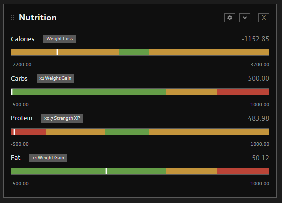

# Nutrition Panel for PZ Pulse

An extension for [PZ Pulse](https://steamcommunity.com/workshop/filedetails/?id=3753700423) that adds a dedicated Nutrition panel for viewing your character’s current nutrition information at a glance.

**Features:**

* Nutrition bars for Calories, Fat, Carbs, and Protein
* A marker showing your character’s current value within each range
* Dynamically color-coded ranges showing what’s ideal for your character based on their current weight
* Displays the stat-related effects associated with each nutrition range

Easily see where your character’s nutrition stands and what effects their current diet may have.

Workshop ID: 3779800672 
Mod ID: PZ_Nutri_Panel

